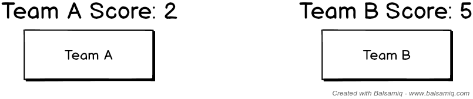

# Keeping up the Score

We are going to introduce ourselves to the DOM by creating elements and attaching events to them.

Check the [page.html](page.html) file - it is a blank HTML with one `div` container.

We are going to need a `page.js` file to control our code.

## Two Buttons

We are going to need two buttons:

* One for `TeamA`
* One for `TeamB`

Also, we are going to need to paragraphs of text, which will hold the score.

When we click `TeamA`'s button, we are going to increase their score. The same thing goes for `TeamB`.

See this mockup:

