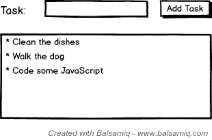

# Really dead simple Todo list with DOM

Every JavaScripter should implement at least one todo list in his life!

We are going to honor this, right now.

Again, use the pure DOM + JavaScript API, but this time, write whatever HTML and CSS you like. Think of how you can achieve that.

We want to have the following feature:

**A userinput, where we enter text, click the `Add` button and the task goes to a list of tasks.**

That's it.

Here is a mockup:



## How to take a value from an input

Consider the following HTML:

```html
<html>
    <body>
        <input type="text" id="task-input">
        <button id="add-task-button">Add Task!</button>

        <script src="example.js"></script>
    </body>
</html>
```

And the following JavaScript:

```javascript
window.onload = function() {
  var button = document.getElementById("add-task-button");
  button.onclick = function(event) {
      var input = document.getElementById("task-input");

      console.log(input.value);
  };
};
```

They are called `example.html` and `example.js`. Run them and check the console, by typing and clickin on the button.
